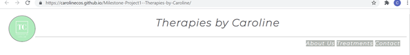
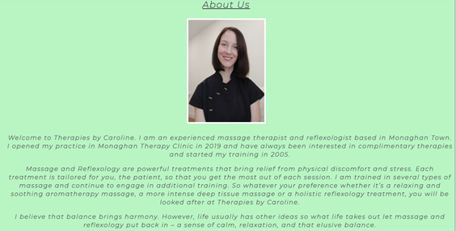
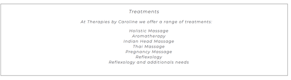
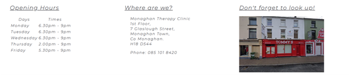
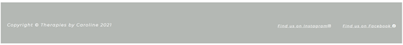
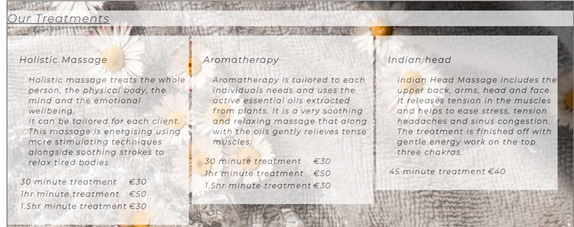
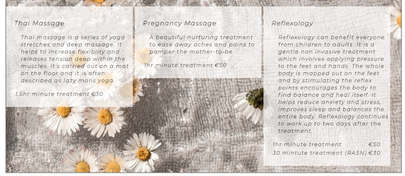
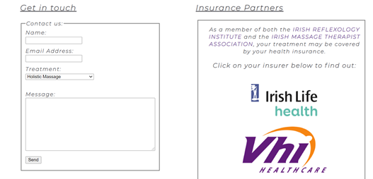
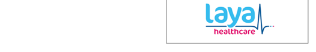

# Therapies by Caroline

[View the live project here](https://carolinecos.github.io/Milestone-Project1--Therapies-by-Caroline/)

Therapies by Caroline is a website designed to provide the public with information about the services offered. It should be easy to use and there will be information on the type of treatments and therapies on offer. It will included opening times, address and contact information including phone number and contact form. It will also introduce the Therapist to the clients in the About us section. It will be a simple and elegant website that isn't too busy so that it will have a calming effect for the potiental client.

     
   
## User Experience

### Site Goals

The goal of the site is to provide information of the business and therapies on offer.

### First time visitor

* I want to be able to find out about the Therapist and if their experience and training will suit my needs.
* I want to see what treatments are on offer and how much they cost.
* I want to know where the business is and how to contact them.
* I want to know if the treatments are covered by my insurance

### As a returning visitor

* I would like to see if the opening times have changed.
* I would also like to know if there are new treatments available.

### Design

## Features

* Navigation Bar
  * This feature is across all three pages with links to each page, About Us, Treatments and Contact us and is fully responsive.
  * It allows the user to easily navigate between pages without the need to use the back and next arrows.

    

* Landing Page
  * The first image that the user will see is that of the Therapist. The therapist is in a uniform and is smiling. This represents a professional but approachable business.
  * The text below the image summarises the therapists experience and what a client may expect from a treatment.
 
     

* Treatments Section
   * Provides an overview on the treatments offered

        

* Information Section
  * Provides information on opening times, address and an image of the exterior of the business
  * This section will help the user locate the business and will keep them informed on the opening hours which can be changed if needed

    

* Footer
  * This section provides links to the businesses social media. This is useful to allow the user to stay in touch with Therapies by Caroline

    

* Treatments Page
  * The therapies offered are present clearly with pricing and an little bit of information on the individual treatments.
  * It helps the user to easily determine which treatment to avail of.
  * The background image is of daisies on a soft grey towel, this gives a calming and relaxing feel to the service as daises represent delicate innocence. 

    
    

* Contact Page
  * The contact page has a contact form so that a user may request information on the treatments on offer.
  * There is a drop down menu so that the user can choose which treatment interest them.
  * There is also links to the associations the therapist is a member of and the insurance partners that cover treatments on offer.

    
    

## Features left to Implement

I would like to add a google map for the business and also a gallery of the treamtents of offer. I would also like to add additional information in the therapies such as Thai Masssage or Reflexology and special needs.

## Testing

* HTML
  * During the development of the website I passed the website the the offical W3C validator.
  * A few errors were returned in relation to h* heading being used in the wrong place. Which i rectified by amending the css file and modifing the font-size to "small".
  * The most persistent error was a stray script which I had placed in the html section instead of the body. I used the CI Love Running Code to compare it with this project.
  * Doing this returned no errors on the [W3C Validator](https://validator.w3.org/nu/?doc=https%3A%2F%2Fcarolinecos.github.io%2FMilestone-Project1--Therapies-by-Caroline%2F)

* CSS
  * No errors were returned when passing through the official [(Jigsaw) Validator](https://jigsaw.w3.org/css-validator/validator?uri=https%3A%2F%2Fcarolinecos.github.io%2FMilestone-Project1--Therapies-by-Caroline%2F&profile=css3svg&usermedium=all&warning=1&vextwarning=&lang=en)

