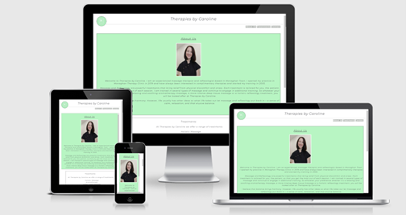

# [Therapies by Caroline](https://carolinecos.github.io/Milestone-Project1--Therapies-by-Caroline/)

Therapies by Caroline is a website designed to provide the public with information about the services offered. It should be easy to use and there will be information on the type of treatments and therapies on offer. It will included opening times, address and contact information including phone number and contact form. It will also introduce the Therapist to the clients in the About us section. It will be a simple and elegant website that isn't too busy so that it will have a calming effect for the potiental client.

    

## Features

* Navigation Bar
 * This feature is across all three pages with links to each page, About Us, Treatments and Contact us and is fully responsive.
 * It allows the user to easily navigate between pages without the need to user the back and next keys.
 
